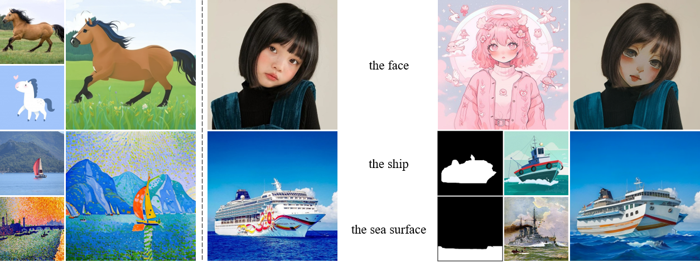

# DiffStyler: Diffusion-based Localized Image Style Transfer [[Arxiv Paper](https://arxiv.org/abs/2403.18461)]
<p float="left">
  
</p>


## Setup
Create the environment and install the dependencies by running:

```
conda create -n diffstyler python=3.9
conda activate diffstyler
pip install -r requirements.txt
```
## Lora Training
Train the style LoRAs of the style images.

```
python lora_train.py --data_path <style_image> --prompt <style_prompt>
```

## Latent Extraction

Compute the intermediate noisy latents of the structure guidance image.

```
python preprocess.py --data_path <content_image>
```

## Running DiffStyler
Run the following command for applying Localized Image Style Transfer:

```
python diffstyler.py --config_path <config_path>
```
The corresponding masks are calculated using FastSAM(https://github.com/CASIA-IVA-Lab/FastSAM).

## Demo
We provide two demos for testing:

```
bash demo1.sh
bash demo2.sh
```


## BibTeX
```
@misc{li2024diffstyler,
      title={DiffStyler: Diffusion-based Localized Image Style Transfer}, 
      author={Shaoxu Li},
      year={2024},
      eprint={2403.18461},
      archivePrefix={arXiv},
      primaryClass={cs.CV}
}
```


## Acknowledgment
### Our code is based on code from the following paper:

Plug-and-Play Diffusion Features for Text-Driven Image-to-Image Translation.
 (https://github.com/MichalGeyer/pnp-diffusers)

